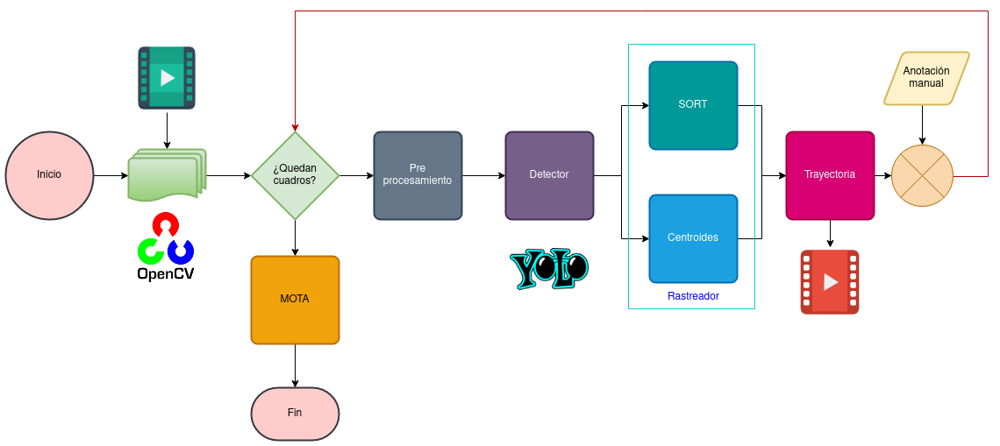

# MOTucr
Multiple vehicle tracker with Yolo, SORT and MOT metrics.

## Code design



## Usage

```
usage: main.py [-h] -i INPUT [-o OUTPUT] [-y YOLO] [-c CONFIDENCE] [-t THRESHOLD] -r TRACKER
               [-x MAXREM] [-g GT] [-p PREDICT] [-d MAXDIST] [-n NFRAMES]

Draws tracking trajectory of vehicles and outputs MOTA metric.

optional arguments:
  -h, --help            show this help message and exit
  -i INPUT, --input INPUT
                        path to input video
  -o OUTPUT, --output OUTPUT
                        path to output video
  -y YOLO, --yolo YOLO  trained YOLO directory (default: yolo)
  -c CONFIDENCE, --confidence CONFIDENCE
                        minimum probability to filter weak detections
  -t THRESHOLD, --threshold THRESHOLD
                        threshold for supressing duplicate detections
  -r TRACKER, --tracker TRACKER
                        tracking algorithm: sort o cent
  -x MAXREM, --maxrem MAXREM
                        number of frames with oclusion for cent
  -g GT, --gt GT        manual annotation of input vid
  -p PREDICT, --predict PREDICT
                        whether to determine metric with ground truth or just trace trajectory
  -d MAXDIST, --maxdist MAXDIST
                        max distance between consecutive ccentroids for same ID
  -n NFRAMES, --nframes NFRAMES
                        number of frames to process
```

See example dir for example usage.

## Based on

- <https://github.com/HodenX/python-traffic-counter-with-yolo-and-sort>
- <https://github.com/abewley/sort>
- <https://www.pyimagesearch.com/2018/07/23/simple-object-tracking-with-opencv/>
- <https://github.com/cheind/py-motmetrics/>

